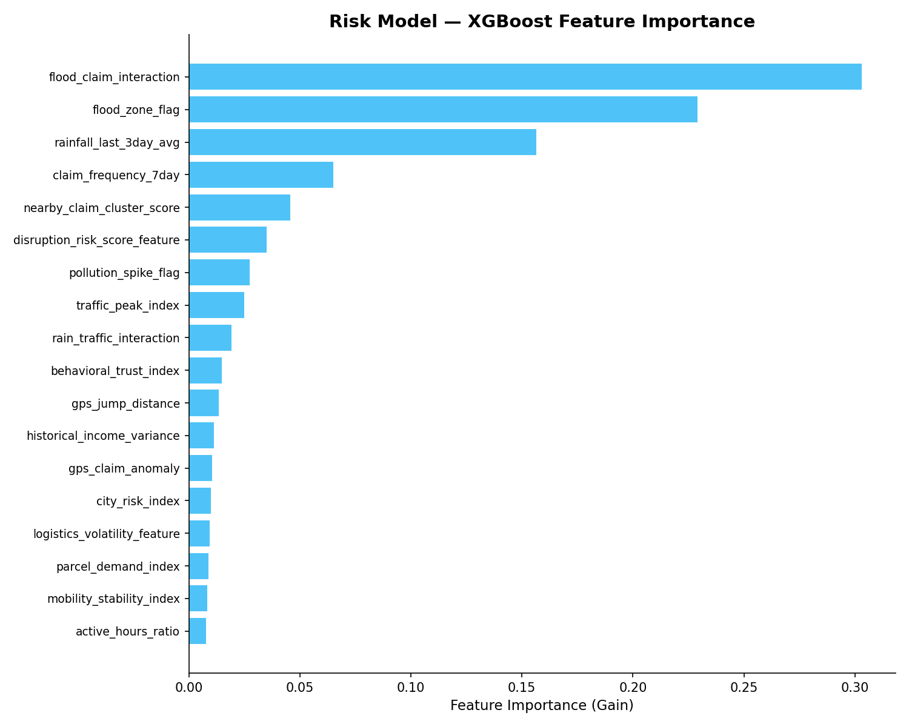
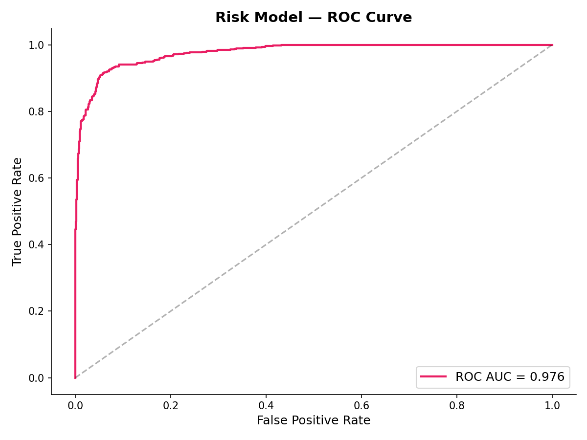
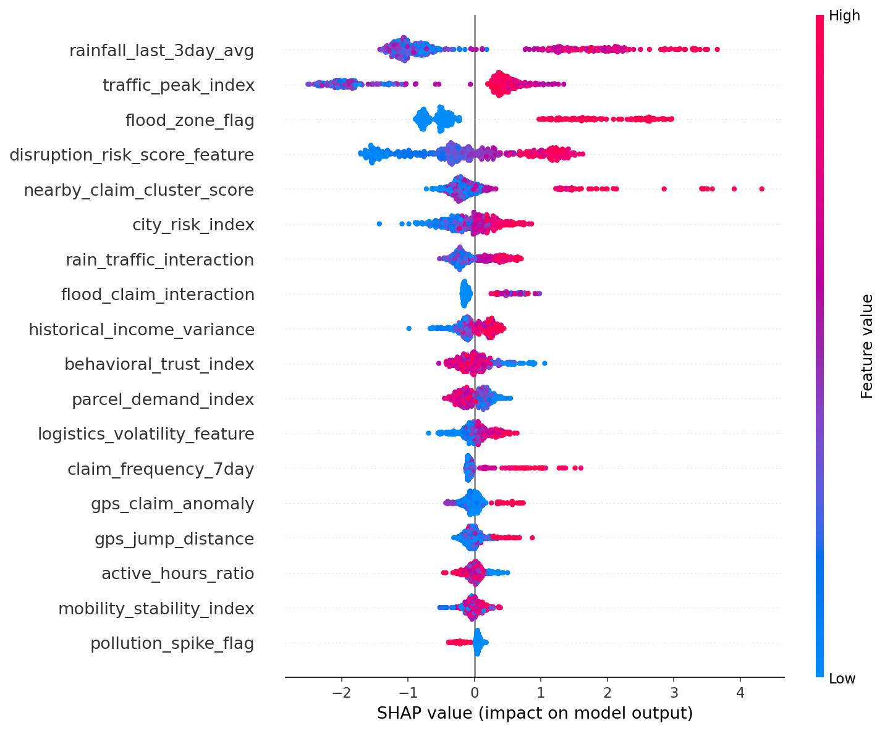
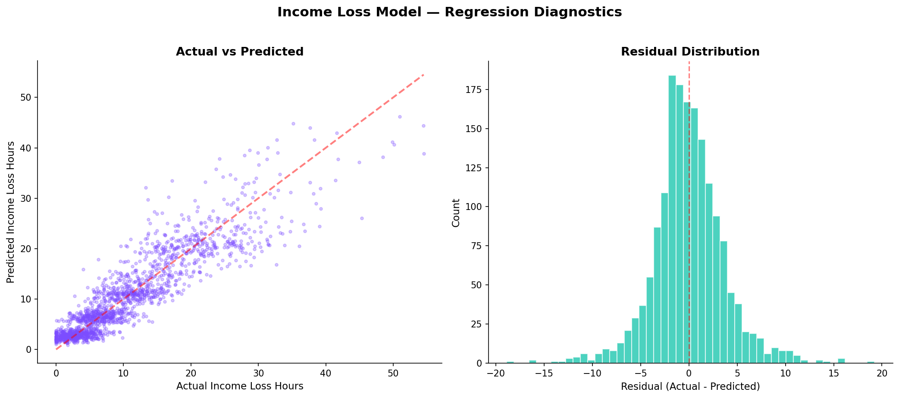
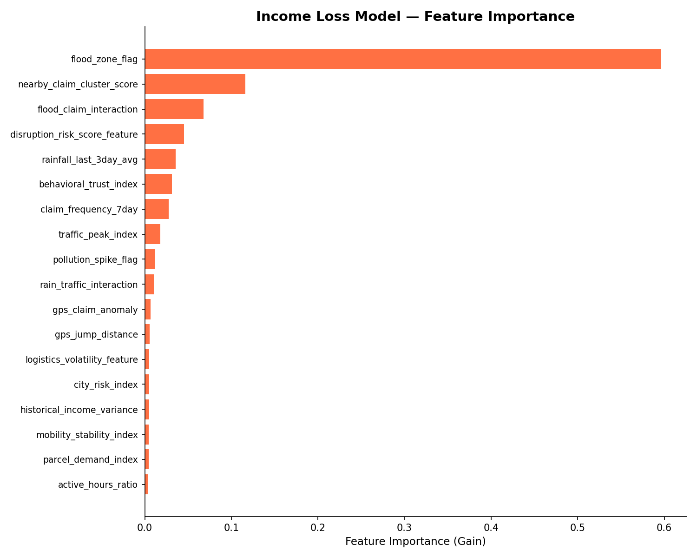
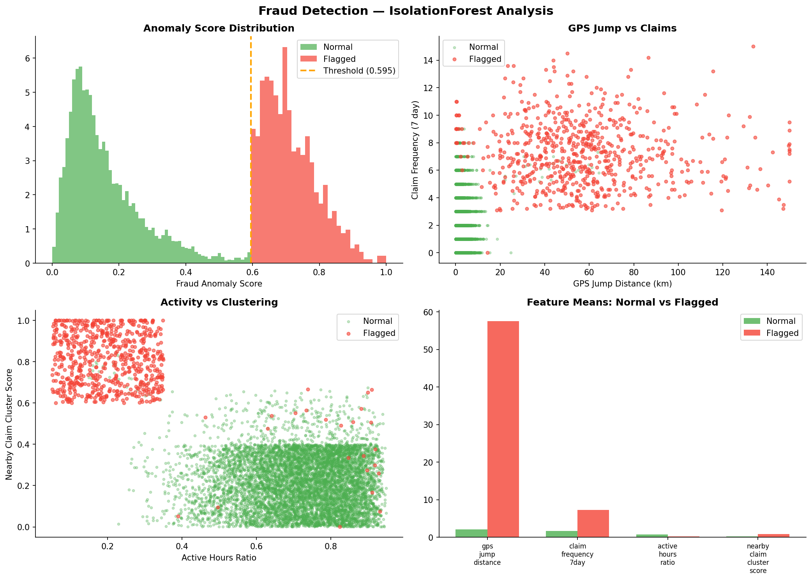

# ShieldPay AI — Model Evaluation Report

**Generated:** 2026-03-20 06:22 UTC
**Pipeline Version:** 1.0.0

---

## Executive Summary

This report evaluates the ML intelligence layer of the ShieldPay AI parametric insurance platform.
Three AI models work together to assess delivery worker claims:

1. **Risk Classifier** — Predicts whether a worker faces high income loss risk
2. **Income Loss Regressor** — Estimates expected income loss hours
3. **Fraud Detector** — Identifies anomalous claim patterns

These models feed into a **Trust Score Fusion Engine** that determines the final
claim decision (auto-approve, manual review, flag, or auto-reject).

---

## Model Performance

### Risk Prediction Model (XGBoost Classifier)

**Target:** `high_income_loss_risk_flag` (binary)

#### Cross-Validation Results (5-Fold Stratified)

| Metric | Mean | Std |
|--------|------|-----|
| Accuracy | 0.9212 | ±0.0074 |
| F1 Macro | 0.9211 | ±0.0074 |
| ROC-AUC | 0.9743 | ±0.0034 |

#### Test Set Results

| Metric | Score |
|--------|-------|
| Accuracy | 0.9265 |
| F1 Macro | 0.9264 |
| ROC-AUC | 0.9764 |

> [!NOTE]
> Time-aware train/test split used (80/20). Test set represents future temporal data.






---

### Income Loss Regression Model (XGBoost Regressor)

**Target:** `expected_income_loss_hours_next_week` (continuous)

#### Rolling Window Cross-Validation (5-Fold Expanding)

| Metric | Mean | Std |
|--------|------|-----|
| MAE | 2.637 | ±0.272 |
| RMSE | 3.511 | ±0.658 |
| R² | 0.8257 | ±0.0338 |

#### Test Set Results

| Metric | Score |
|--------|-------|
| MAE | 2.699 |
| RMSE | 3.708 |
| R² | 0.8185 |





---

### Fraud Detection Model (IsolationForest)

**Approach:** Unsupervised anomaly detection
**Contamination:** 0.08
**Optimal Threshold:** P92 = 0.5952

#### Threshold Sensitivity Analysis

| Percentile | Threshold | Flagged Count | Flagged % |
|------------|-----------|---------------|-----------|
| P85 | 0.3482 | 1275 | 15.0% |
| P90 | 0.4642 | 850 | 10.0% |
| P92 | 0.5952 | 680 | 8.0% |
| P95 | 0.6746 | 425 | 5.0% |
| P97 | 0.7247 | 255 | 3.0% |

> [!IMPORTANT]
> P92 was selected to align with the ~8% expected fraud rate in the synthetic data. In production, this should be calibrated with labeled fraud data.

#### Feature Contribution (Normal vs Flagged Workers)

| Feature | Normal Mean | Flagged Mean | Ratio |
|---------|-------------|--------------|-------|
| `gps_jump_distance` | 2.100 | 57.561 | 27.41x |
| `claim_frequency_7day` | 1.664 | 7.260 | 4.36x |
| `active_hours_ratio` | 0.718 | 0.219 | 0.30x |
| `nearby_claim_cluster_score` | 0.219 | 0.797 | 3.64x |




---

### AI Decision Explanation Logic

The trust score fusion engine produces 4 possible recommendations:

| Trust Score | Recommendation | Action |
|-------------|----------------|--------|
| ≥ 0.75 | `AUTO_APPROVE` | Claim automatically approved and queued for payout |
| 0.50 – 0.74 | `MANUAL_REVIEW` | Claim sent to human reviewer with AI analysis |
| 0.30 – 0.49 | `FLAG_SUSPICIOUS` | Claim flagged for fraud investigation |
| < 0.30 | `AUTO_REJECT` | Claim automatically rejected |

#### Trust Score Components

```
trust_score = (
    mobility_stability_index    × 0.25  +   # GPS consistency + activity
    behavioral_trust_index      × 0.25  +   # Claims pattern + engagement
    (1 - fraud_anomaly_score)   × 0.30  +   # Fraud inverse (most weighted)
    disruption_risk_match       × 0.20      # Environmental disruption
)
```

#### Decision Flow

```
Weather Feed → Risk Model (XGBoost) → Disruption probability
                    ↓
Worker Features → Fraud Model (IsolationForest) → Anomaly score
                    ↓
All Signals → Trust Score Fusion → Recommendation
                    ↓
              AUTO_APPROVE / MANUAL_REVIEW / FLAG / AUTO_REJECT
                    ↓
              Decision logged with full reasoning chain
```

> [!TIP]
> The fraud safety signal carries 30% weight — the heaviest component — because
> preventing fraudulent payouts has the highest financial impact.


---

## Feature Engineering Summary

| Derived Feature | Description | Components |
|-----------------|-------------|------------|
| `disruption_risk_score_feature` | Environmental disruption signal | rainfall + flood + traffic + pollution |
| `mobility_stability_index` | Worker mobility consistency | GPS stability + active hours |
| `logistics_volatility_feature` | Demand/income volatility | Demand variance + income variance |
| `behavioral_trust_index` | Worker trustworthiness signal | Activity + claim pattern + clustering |
| `rain_traffic_interaction` | Compounding disruption | rainfall × traffic |
| `flood_claim_interaction` | Genuine disruption claims | flood × claims |
| `gps_claim_anomaly` | Fraud signal | GPS jump × claim rate |

---

## Recommendations for Production

> [!WARNING]
> The current models are trained on **synthetic data**. Before production deployment:

1. **Data Integration** — Replace synthetic data with real weather APIs, delivery platform data, and historical claims
2. **Label Quality** — Obtain verified fraud labels from investigations team
3. **Model Retraining** — Implement automated retraining on new data quarterly
4. **Threshold Calibration** — Tune fraud threshold using business cost matrix
5. **A/B Testing** — Run shadow mode alongside manual review before full automation
6. **Monitoring** — Track feature drift, model performance degradation, and decision outcome feedback
