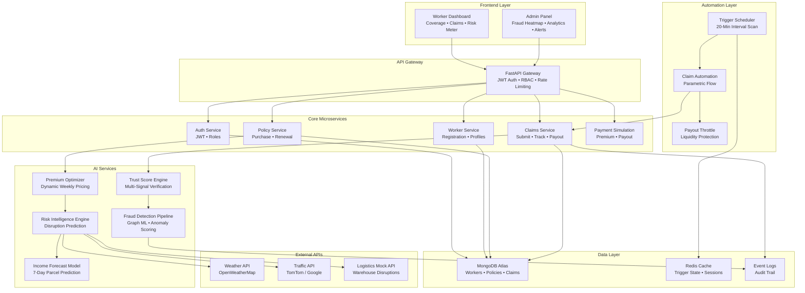
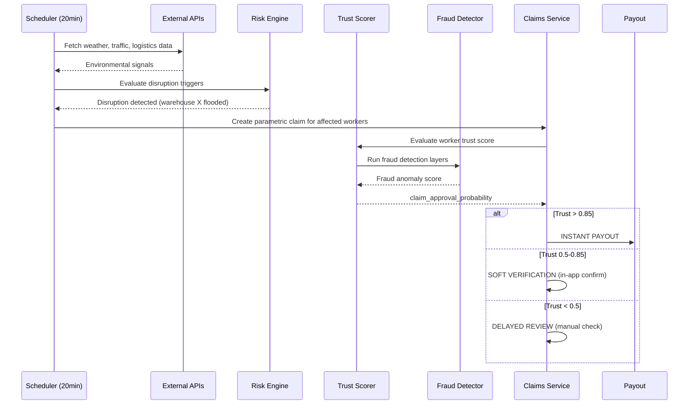

# ShieldPay AI — System Architecture

## Overview

ShieldPay AI is a **parametric micro-insurance platform** that protects e-commerce delivery workers (Amazon/Flipkart last-mile partners) in India from **income loss caused by external operational disruptions**. The system uses AI-driven risk intelligence, automated parametric triggers, and multi-layer fraud detection to deliver instant, fair payouts.

## System Design Diagram



## Data Flow: Parametric Claim Lifecycle



## Trust Score Model

```
claim_approval_probability = weighted(
    real_movement_score      × 0.25,
    delivery_activity_score  × 0.25,
    environmental_match_score × 0.20,
    historical_trust_index   × 0.15,
    fraud_anomaly_score      × 0.15
)
```

### Multi-Layer Fraud Defense

| Layer | Signals | Detection Method |
|-------|---------|-----------------|
| **Behavioral Movement** | Accelerometer, route continuity, teleport detection | Time-series anomaly detection |
| **Delivery Correlation** | Parcels assigned vs delivered, warehouse dependency | Statistical deviation analysis |
| **Environmental Consensus** | Disruption clustering, telecom degradation, traffic | Cross-worker correlation |
| **Device Authenticity** | Emulator/root flags, background streaming, app fingerprint | Device integrity scoring |
| **Graph Fraud Rings** | Temporal claim spikes, network connections | Graph ML community detection |

## Premium Pricing Formula

```
premium = base_price + (predicted_income_volatility × risk_multiplier)

Where:
  base_price = ₹15-50/week based on coverage tier
  predicted_income_volatility = AI-forecast of parcel volume variance
  risk_multiplier = composite risk score (weather + traffic + warehouse + seasonal)
```

## Technology Stack

| Component | Technology |
|-----------|-----------|
| Frontend | React 18 + Vite, Recharts, CSS3 |
| Backend | FastAPI, Python 3.11+ |
| Auth | JWT + bcrypt, RBAC |
| Database | MongoDB (motor async driver) |
| Cache | Redis |
| AI/ML | scikit-learn, NetworkX |
| Scheduler | APScheduler |
| External | OpenWeatherMap, TomTom, Mock APIs |
